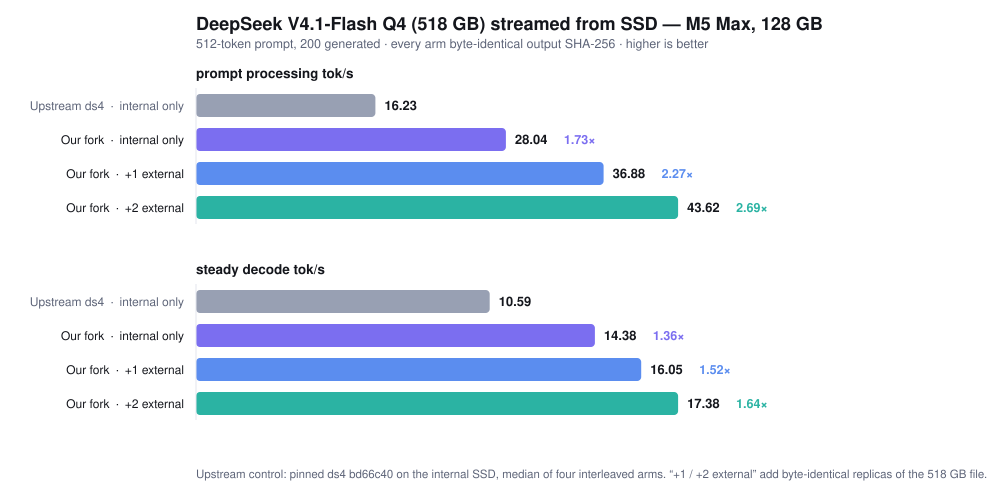

# Argodrive DeepSeek V4.1 benchmark engine

**DeepSeek V4.1 Flash (518 GB, 4-bit) streamed from SSD on a 128 GB MacBook Pro M5 Max — 512-token prompt, 200 generated, output SHA-256 identical to upstream on every arm:**

| | prompt processing tok/s | steady decode tok/s |
|---|---:|---:|
| upstream ds4, internal SSD only | 16.23 | 10.59 |
| this fork, internal SSD only | **28.04** (1.73×) | **14.38** (1.36×) |
| this fork, + one external NVMe | 36.88 (2.27×) | 16.05 (1.52×) |
| this fork, + two external NVMe | **43.62** (2.69×) | **17.38** (1.64×) |
| this fork, + two external NVMe, GPU keep-alive (2026-09-17, default in the profile) | 44.28 (2.73×) | **18.06** (1.71×) |

<picture>
  <source media="(prefers-color-scheme: dark)" srcset="argodrive/charts/ladder-dark.svg">
  
</picture>

The keep-alive row: `DS4_ARGODRIVE_GAP_KEEPALIVE=1` with `DS4_TP_KEEPALIVE_TGS=8` (commit 361289f) runs a tiny ALU kernel on a second queue only while the CPU waits for expert reads, because the GPU otherwise drops into low-power states during those waits and every kernel after them runs slower. Four interleaved pairs at 512/200, all positive (+0.31, +0.65, +0.84, +0.54 tok/s), medians 17.34 → 17.93; a shorter spin (`DS4_TP_KEEPALIVE_ITERS=300000`, so the kernel stops sooner when a read lands) adds another four positive pairs, 17.80 → 18.06, output identical. Continuous spinning gains nothing. The chart above predates this row.

The single-drive row needs no extra hardware: commit 38e200a lets the selective prefill path run on one source. Details, method and raw arms: [argonautlabs.ai/research](https://argonautlabs.ai/research/deepseek-2026-09-15.html) · tooling: [ArgoDrive](https://github.com/argonautlabsai/argodrive).


Built on [ds4 by Salvatore Sanfilippo (antirez) and contributors](https://github.com/antirez/ds4), with experimental streaming changes and [ARGODRIVE tooling](https://github.com/argonautlabsai/argodrive). Original licences and upstream acknowledgements are preserved; see [credits](CREDITS.md).

This branch includes the actual expert replica reader and Metal scheduling changes used by the V4.1 benchmarks. No separate provider library is required. It is pinned to upstream `bd66c402070042bf0a79ad6ece8242de4c93680c`. The earlier `argonaut-v41` branch contains a different GLM integration and is not this benchmark engine.

## Try Argodrive on your Mac

[**Download the Apple-silicon beta**](https://github.com/argonautlabsai/argodrive/releases/tag/v0.2.0-beta.3) · [**Testing guide**](https://github.com/argonautlabsai/argodrive/blob/beta-20260914/docs/BETA-TESTING.md) · [**Argodrive GitHub**](https://github.com/argonautlabsai/argodrive)

The beta provides live drive charts and saved-run comparison. Install it, open Live Hardware, and choose a folder containing supported benchmark runs to inspect and compare them. Engine benchmarks use the recipe below; the app is not a one-click speed optimizer. The beta is ad-hoc signed and not notarized; model files are separate. [Report testing feedback](https://github.com/argonautlabsai/argodrive/issues).

## Build and reproduce

```sh
git clone --branch argonaut-v41-benchmark https://github.com/argonautlabsai/ds4-argodrive.git
cd ds4-argodrive
# Match the recorded compiler/SDK; do not rely on an older selected CLT.
export DEVELOPER_DIR=/Applications/Xcode.app/Contents/Developer
export SDKROOT="$(xcrun --sdk macosx --show-sdk-path)"
xcrun clang --version
make -j4 CC="$(xcrun --find clang)" ds4 ds4-bench ds4-server
```

Follow [the complete recipe](argodrive/reproduce/README.md) to verify model copies and run internal-only, one-enclosure and two-enclosure configurations. The recipe includes a pinned upstream control, physical disk sampler, output comparison and sanitizer fixtures. Model files are not included.

The reader is implemented in `argodrive_read.h`: complete identical GGUF replicas, 256 KiB block splitting with weights 2:1:1, concurrent reads into disjoint buffer spans, and a completion barrier that rejects partial buffers. Scheduling changes live in `ds4.c`, `ds4_metal.m`, and `metal/moe.metal`. Engram uses eight parallel whole-row readers on the primary SSD. This branch does not implement Engram striping, a learned placement policy, or the GLM expected-completion balancer.

## Benchmark results

**14.11 tok/s with internal storage and two SSD enclosures — 40.1% faster than upstream ds4 on internal storage.**


| Configuration | Median tok/s | Measured range | Gain vs upstream |
|---|---:|---:|---:|
| Upstream ds4 — internal | 10.07 | 10.01–10.12 | Baseline |
| Our fork — internal | 12.32 | 12.28–12.36 | +22.4% |
| Our fork — internal + one enclosure | 13.46 | 13.14–13.65 | +33.7% |
| Our fork — internal + two enclosures | 14.11 | 14.04–14.17 | +40.1% |

Measured on an **M5 Max, 128 GiB, DeepSeek V4.1 Flash Q4**, using the same **512-token prompt and 512 generated tokens**. Rates include the first decode step and exclude prefill and startup. Two runs per configuration, plus a third one-enclosure check; all nine outputs were byte-identical, with no swap growth. Dashboard collection was off. Expert reads use the configured SSD replicas; Engram stays on internal storage.

[**Test details and reproduction**](argodrive/results/FINAL-MATCHED-2026-09-14.md) · [**Measured data**](argodrive/results/final-matched-2026-09-14.json) · [Chart source](argodrive/results/charts/generate-final.py)

---

## Upstream ds4 documentation (preserved)

<p align="center">
  
</p>

**DwarfStar** aims to be the best way to run a few excellent large
language models on consumer hardware (that is, hardware that people
can actually own). To reach this goal, we are building
a small native inference engine optimized first for
**DeepSeek V4 Flash** (including the experimental vision model),
**DeepSeek V4.1 Flash** (Metal only),
and additionally **GLM 5.2 and 5.3**, **GLM 5.3 Flash** and
**DeepSeek V4 PRO**. The code is self-contained and
deliberately narrow, not a general GGUF runner: you need to use the
GGUF files the project produces, that are part of the project
itself.

We test things in integration: model loading, prompt rendering,
tool calls, KV state, the HTTP server, and the coding agent are built and tested together.
The repository also includes tools and data for GGUF, imatrix, quality, and speed.

## Supported hardware

* **Metal**, the primary target, on Macs with 96 GB or more. Smaller machines
  can use SSD streaming. SSD streaming is also needed in order to run very
  large models such as full GLM 5.x (not Flash) on 128GB systems.
* **NVIDIA CUDA**, the DGX Spark is our main gaol. DwarfStar also supports multi-GPU systems that are not supported by other backends, for instance it can run DeepSeek v4 Flash on Ada Lovelace cards.
* **ROCm** on Strix Halo systems such as the Framework Desktop.

This project would not exist without **llama.cpp and GGML**, make sure to read
the acknowledgements section, a big thank you to Georgi Gerganov and all the
other contributors.

**Model support is intentionally opportunistic**. The project follows the best open
weights for useful local machine sizes, especially 128 GB laptops and 256/512 GB
workstations. A model may be removed when a better replacement arrives.

# So, what can I do with this software?

* You can run a very capable models in your consumer hardware, a MacBook, a DGX Spark, or a Strix Halo for example. Even if you have not enough RAM, with SSD streaming, you can run it at a decent speed.
* You can use multiple CUDA cards as a multi-user LLM server. Ada Lovelace, including L40S, is supported: newer models can run here even when their other inference implementations require newer GPUs. Our eight-L40S Flash setup has reached about 126 t/s aggregate generation with 16 sessions.
* Using two 128 GB Macs connected with RDMA, you can run 4-bit DeepSeek Flash or GLM 5.3 Flash with tensor parallelism. Larger GLM 5.2 quants need larger machines, such as Mac Studios.
* You can also use pipeline paralellism to glue together multiple systems to sum their RAM and run larger models.

## Motivations

* Capable open-weight models now fit on high-end personal machines.
* DeepSeek V4 Flash and PRO, GLM 5.2, tolerate aggressive routed-expert quantization.
* Compressed KV caches and fast local SSDs make long contexts practical.
* The idea of an inference system specialized for a few models.

# AI full disclosure

* This software is developed with **strong assistance from AI coding agents** and with humans leading the ideas, testing, and debugging. We say this openly because it shaped how the project was built. If you are not happy with AI-developed code, this software is not for you. The acknowledgement below is equally important: this would not exist without `llama.cpp` and GGML, largely written by hand.

## Acknowledgements to llama.cpp and GGML

`ds4.c` does not link against GGML, but it **exists thanks to the path opened by the
llama.cpp project and the kernels, quantization formats, GGUF ecosystem, and hard-won
engineering knowledge developed there**.
We are thankful and indebted to [`llama.cpp`](https://github.com/ggml-org/llama.cpp)
and its contributors. Their implementation, kernels, tests, and design choices were
an essential reference while building this DeepSeek V4 specific inference path.
Some source-level pieces are retained or adapted here under the MIT license: GGUF
quant layouts and tables, CPU quant/dot logic, and certain kernels. For this
reason, and because we are genuinely grateful, we keep the GGML authors copyright
notice in our `LICENSE` file.

## Status

The software is currently very fast changing. Consider it beta quality.
Before each release, a big QA run is executed, however instabilities
and regressions are definitely possible.

# How to use this project?

I (Salvatore) believe that the way projects should be shipped and used changed because of AI. The main differences today are:

1. With AI, users can modify the software in significant ways with low efforts, costs, and even lacking deep domain knowledge about the task they want to accomplish. For instance, a DwarfStar user with a specific hardware setup can ask a coding agent to improve the inference speed of this software for the specific hardware setup, asking the model to reach the maximum prefill and generation speed without impacting correctness, and also asking to do a deep QA pass.
2. Similiarly, because of "1", software may be shipped in a different way than before. It must be more a working template for the biggest use cases, without trying to cover every possible setup. If DwarfStar showcases a few good implementations of tensor parallel execution, the code will work as a rail for implementing the same feature in specific conditions, for a new model, and so forth.

So, while this project attempts to be usable for the featured models and the most common hardware setups, I ask you, if you have access to coding agents, to consider using coding agents as an interface to discover the project, make modifications, create personalized setups. This way you can likely do more than what we ship, and certain things that are not documented or implemented, and that you require, are potentially very easy to achieve.

## Start Here

```sh
git clone https://github.com/antirez/ds4.git
cd ds4
```

Choose your build. The platform guides cover prerequisites, memory sizing,
and hardware-specific setups:

| Platform guide | Build |
| --- | --- |
| [Metal on Apple Silicon](docs/METAL.md) | `make` |
| [DGX Spark](docs/DGX_SPARK.md) | `make cuda-spark` |
| [Strix Halo / Framework Desktop](docs/STRIX_HALO.md) | `make strix-halo` |
| [One or more CUDA cards, including Ada/L40S](docs/CUDA_MULTI_GPU.md) | `make cuda-generic` |

For a first run on a 96 or 128 GB machine, download DeepSeek V4 Flash Q2:

```sh
./download_model.sh ds4f-q2
```

Downloads go in `gguf/`. Repeat the command to resume an interrupted download.
Leave memory for the context and runtime buffers as well as the model.
See [other models](docs/MODELS.md) or use [SSD streaming](docs/SSD_STREAMING.md)
on a smaller Mac.

## Everyday Use

Once built and with a model downloaded:

```sh
./ds4
./ds4 -p "Explain Redis streams in one paragraph."
./ds4-agent
./ds4-server --ctx 32768
```

The default model is `ds4flash.gguf`, a link updated by main-model downloads.
Pass `-m FILE` to choose explicitly. Commands normally run from the repository
root; use `--chdir /path/to/ds4` when launching elsewhere.

The server listens at `http://127.0.0.1:8000` by default; see [serving](docs/SERVER.md)
for API access and multiple sessions.

The interactive CLI keeps a multi-turn conversation. Use `/help`, `/read FILE`,
`/ctx N`, and `/quit`. Ctrl+C interrupts generation and returns to the prompt.
Run each binary with `--help` for its full options.

### Native coding agent

`ds4-agent` runs inference directly, without a separate HTTP server. It keeps
the token history and live model state together, shows prefill progress, and
uses the model's native tool format. DeepSeek and GLM have their own templates.

Use `/hints on` for occasional, brief explanations of the programming choices
behind the work, and `/hints off` to stop them. Changes take effect at the next
conversation boundary without rebuilding the cached context. New and resumed
sessions start with hints off.

Sessions are stored in `~/.ds4/kvcache`:

| Command | Action |
| --- | --- |
| `/save` | Save the current session |
| `/list` | List saved sessions |
| `/switch <sha>` | Resume a session |
| `/del <sha>` | Delete a saved session |
| `/strip <sha>` | Keep text and title, removing the large KV payload |

Compatible local KV snapshots avoid rebuilding the prompt. Stripped sessions
and network TP restores require prefill. Sessions containing images cannot yet
be saved. Saved conversations and traces may contain private information.

For Pi, OpenCode, Codex CLI, or Claude Code, use `ds4-server` instead and follow
the [client setup guide](docs/CLIENTS.md).

### Models, images, and speculation

[Models and vision](docs/MODELS.md) lists the supported downloads and memory
requirements. DeepSeek Vision Experimental uses a different checkpoint from
Flash 0731; GLM 5.3 Flash adds vision to the same text model.

DeepSeek V4.1 Flash text and vision run on Metal. Q2 runs with SSD streaming
on one 128 GB Mac, or resident across two using RDMA. Q4 needs SSD streaming
or a 512 GB Mac. Engram tables remain on disk in every mode, so use a fast
local SSD. See the [model guide](docs/MODELS.md#deepseek-v41-flash) for downloads
and setup.

With the matching encoder passed as `--vision FILE`, use `/read image.png`
in the CLI or `view_image` in the native agent.

Speculative decoding is opt-in. GLM uses `--mtp`; V4 Flash DSpark needs a matching
support GGUF. It can improve generation, but not every workload benefits.
Read [speculative decoding](docs/SPECULATIVE_DECODING.md) for setup and the
difference between default opportunistic sampling and `--mtp-exact-sampling`.

### Output and power

Thinking is enabled by default. Use `--nothink` or `/nothink` for direct
answers, and `--think` or `/think` to enable it again.
For V4.1, `ds4` and `ds4-agent` also accept
`--think-level 25` or `/think 25`: 1 to 100 sets the reasoning effort, and
0 disables thinking. `--think` selects 75, `--think-max` selects 100.
Changing the level in a conversation rebuilds its cached prefix.
The normal sampling defaults are temperature 1, top-p 1, and min-p 0.05;
`--temp 0` selects greedy output.

For DeepSeek V4, `--power N` trades throughput for lower sustained GPU load.
The default is 100. V4.1 and GLM currently require `--power 100`.

DeepSeek V4 Flash and GLM 5.3 Flash also support directional steering. Load a
vector with `--dir-steering-file FILE`; `/steer F` adjusts its scale for
subsequent tokens in a local CLI or agent session, without rebuilding the
existing KV cache. See [steering documentation](dir-steering/README.md).

`--prefix-file FILE` preloads complete `USER:` / `ASSISTANT:` pairs before
the live conversation. A turn marker must start a line, roles must alternate,
and the last turn must be `ASSISTANT:`.

## Capability Evaluation

`ds4-eval` runs embedded capability regression tests against a real GGUF.
These are DwarfStar integration checks, not official leaderboard scores.

```sh
./ds4-eval -m ds4flash.gguf --trace /tmp/ds4-eval.txt
./ds4-eval -m ds4flash.gguf --suite hard-smoke
./ds4-eval -m ds4flash.gguf --suite hard --retry-incomplete
```

The default suite is `core`; `--suite all` runs core and hard cases.
`--list-cases` lists tests without loading a model. `--plain` selects
non-interactive output, and `--regrade-trace FILE` scores an existing trace
without generating again. Sources and licenses are in [EVAL_DATA.md](EVAL_DATA.md).
For inference correctness and release checks, read [testing](docs/TESTING.md).

## Speed

This recorded DeepSeek V4 Flash Q2 sweep uses an M5 Max with 128 GB RAM,
2048-token continued-prefill intervals, and 128 greedy generation tokens per
frontier. It is a baseline, not a fresh benchmark of every commit.


See [performance and benchmarking](docs/PERFORMANCE.md) for the full numbers,
DGX Spark results, comparison conditions, and benchmark commands.

## Detailed Guides

- [Models and vision](docs/MODELS.md): Flash, PRO, GLM, and matching encoders.
- [SSD streaming](docs/SSD_STREAMING.md): run larger than RAM and size the cache.
- [Inference across machines](docs/DISTRIBUTED.md): two-Mac TP/RDMA and layer pipelines.
- [Speculative decoding](docs/SPECULATIVE_DECODING.md): DSpark, GLM MTP, and sampling.
- [Serving](docs/SERVER.md): APIs, images, batching, and disk KV caches.
- [Coding agent clients](docs/CLIENTS.md): Pi, OpenCode, Codex CLI, and Claude Code.
- [Performance](docs/PERFORMANCE.md): reproducible measurements and recorded baselines.
- [Testing and development](docs/TESTING.md): regression tests, debugging, and model-building tools.

Read [CONTRIBUTING.md](CONTRIBUTING.md) before sending a pull request.

## Logo

The DwarfStar logo was designed by hand by Salvatore Sanfilippo, made more
graphical with AI, and manually reworked by Ben Gnomino, whose human touch made
it rock.
