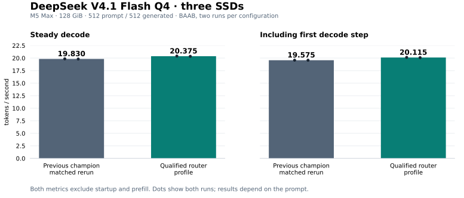

# V4.1 router — completed performance qualification, September 21

**20.115 generation-inclusive tok/s at pp512/tg512**, with a steady median of
**20.375 tok/s**, on an M5 Max with 128 GiB, internal SSD and two Thunderbolt 5
NVMe enclosures. The resumed 512-token BAAB passed, as did one alternate-prompt
pair. Release: `v41-router-qualified-20260921`; profile: `v41-router-20260921`.
Engine source and settings are unchanged from the original candidate.



| Prompt / output tokens | Order | Previous champion steady | Router steady | Steady gain | Router inclusive |
|---|---|---:|---:|---:|---:|
| Main / 200 | ABBA | 19.665 | **20.105** | +2.24% | **19.445** |
| Main / 512 | BAAB | 19.830 | **20.375** | +2.75% | **20.115** |
| Alternate / 200 | AB, one pair | 15.940 | **16.240** | +1.88% | **15.780** |

Each main-prompt group has two runs per configuration. The alternate result is
one pair, not a repeated qualification. All prompts use 512 tokens, with 4,096
context allocation and 4,200 cached experts. The main prompt is the opening of
*I Promessi Sposi*. The [alternate file](../../reproduce/prompts/alternate.txt)
is a synthetic benchmark passage with an appended fictional CFO question;
only its first 512 model tokens are consumed as raw completion input. Its prose
is benchmark input, not a description of the actual test settings.

The 512-token router runs were **20.40 / 20.35 steady** and **20.14 / 20.09
inclusive**; control runs were **19.85 / 19.81 steady** and **19.58 / 19.57
inclusive**. The inclusive improvement is **2.76%**. All ten included arms match
their prompt's reference output, retain the full cache, have zero swap growth
and hold 1,620 MHz active decode GPU clocks. Existing swap was not zero.

Steady excludes the first decode step; inclusive includes it. Both exclude
startup and prefill. The first token is produced by prefill; the first decode
step is a separate operation. Two repeats give an observed range, not a
confidence interval. This compares our previous champion, **not upstream ds4**.
It does not establish a universal 20 tok/s result, broad model-quality
validation or chat/server performance. Keepalive increases power consumption.

At pp512/tg512, median engine-launch-to-first-token markers were **11.731 s**
for the control and **11.731 s** for the router. Median prefill rates were
44.955 and 44.930 tok/s respectively. These engine timestamps are not
client-observed TTFT; the decode improvement is not a first-response claim.

## Implementation and profile

The implementation is included in the repository. Source revision
`a53dab7bdd435b41974371a393e7eb883fa9774b` adds a specialized 384-expert/top-six
router with SIMD selection. It preserves the padded reference sorting network,
tie behavior and floating-point materialization boundaries while reducing
dispatches and threadgroup synchronization. A small fusion stack combines HC
expansion/BF16 rounding, RoPE input, QAKV, Q8 row epilogues and view caching.

The [profile](profile.json) is `v41-router-20260921`. It keeps prefill weights
10:5:5, decode weights 10:6:6, nine persistent readers, 4,200 cached experts and
32-token cache decay. Engram stays on the internal SSD with eight asynchronous
readers. Keepalive remains enabled, consumes additional power and is workload
dependent. Existing profiles and engine defaults are unchanged.

Cache decay 64/128 and Q8 row tiling 4/8 lost speed in matched screens and are
excluded. First-decode-step overhead remains open. No quantization, model file,
requested length or benchmark timer boundary was changed.

## All attempts are retained

[Twenty timing CSVs](arms/) · [Measured results and byte accounting](results.json)
· [75 source checksums](source-sha256.json) · [Validation](validation.json)

| Group | Order | Steady tok/s in order | Decode GPU MHz in order | Disposition |
|---|---|---|---|---|
| 200-token main prompt | ABBA | 19.64 / 20.15 / 20.06 / 19.69 | 1620 / 1620 / 1620 / 1620 | passed, two repeats each |
| First 512-token group | BAAB | 20.40 / 15.52 / 15.94 / 16.69 | 1620 / 916 / 961 / 985 | excluded: clock gate |
| Repeated 512-token group | BAAB | 20.43 / 19.82 / 19.92 / 16.35 | 1620 / 1620 / 1620 / 951 | excluded: clock gate |
| Earlier alternate, 200 tokens | AB | 15.89 / 14.59 | 1620 / 1123 | excluded: clock gate |
| Resumed 512-token main prompt | BAAB | 20.40 / 19.85 / 19.81 / 20.35 | 1620 / 1620 / 1620 / 1620 | passed, two repeats each |
| Resumed alternate, 200 tokens | AB | 15.94 / 16.24 | 1620 / 1620 | passed, one pair only |

A is the previous `champion-v41-20260921` binary/profile; B is the router profile.
The clock gate requires at least 1,600 MHz and no more than 1% variation between
arms; repeated groups must also meet a 2% speed-range gate. Each rejected group
remains excluded in full. Faster individual runs from those groups were not
substituted into the resumed groups. The source and profile did not change to
obtain the resumed results. The cause of the earlier clock changes is unestablished.

Physical counters cover all three SSDs in prefill and decode. Application
counters close; physical/application residuals and sampled boundary uncertainty
remain explicit in results.json. Residuals are unassigned, not forced to zero.
All first-token durations are engine markers. This evidence package exports
numeric benchmark records and generic device roles, without private paths,
device serials, local addresses or session transcripts.

The [original candidate release](https://github.com/argonautlabsai/ds4-argodrive/releases/tag/v41-router-20260921)
and [previous champion](../../champions/2026-09-21/README.md) remain available
under unchanged tags. The new tag records completion of the pending performance
gates; the software remains an experimental prerelease.

## Build and reproduce

```sh
git clone --branch v41-router-qualified-20260921 https://github.com/argonautlabsai/ds4-argodrive.git
cd ds4-argodrive
export DEVELOPER_DIR=/Library/Developer/CommandLineTools
export SDKROOT="$(xcrun --sdk macosx --show-sdk-path)"
xcrun clang --version
make -j4 CC="$(xcrun --find clang)" ds4 ds4-bench ds4-server
python3 argodrive/candidates/2026-09-21-router/verify-results.py
```

The measured build used **Apple clang 14.0.3 / macOS 26.4 SDK**. Match and verify
the installed toolchain; a directory selection does not install that version.
Keep the executable beside its `metal/` sources. Model files are separate.

Follow the [complete profile command](../../reproduce/V41-ROUTER.md#run), using
three fully verified, identical Q4 GGUF copies and the physical sampler.
Use `--profile v41-router-20260921`. The model is 518,596,067,328 bytes with SHA-256
`a5e2e2c3ada4b2e98d9f9e4b50f6d9c2a12c2c96f5da165c07e13aff9264984e`.
The runner refuses unverified replicas, reduced cache allocations and excessive
swap growth. Use separate output directories and retain failed attempts.

## Validation scope

CLI, benchmark and server builds passed. The 27 Python tests, twelve focused
fusion/reader/cache/keepalive fixtures, dedicated router fixture (84 cases ×
four modes × two buffer-view offsets), core V4.1 Metal fixture, command-memory
fixture and CPU-only compile/link/help check passed. No CPU model inference,
CUDA, distributed hardware or broad quality suite was run. The public profile's
exported settings match the measured candidate exactly. Source hashes match all
75 recorded engine/build/shader files.

The verifier below checks recorded evidence; it does not rerun inference:

```sh
python3 argodrive/candidates/2026-09-21-router/verify-results.py
python3 -m unittest discover -s argodrive/reproduce/tests -p 'test_*.py'
python3 argodrive/reproduce/test-champion.py
```

Built on [ds4 by antirez and contributors](https://github.com/antirez/ds4).
[Credits and AI assistance](../../../CREDITS.md) ·
[Argodrive app and downloads](https://github.com/argonautlabsai/argodrive).
