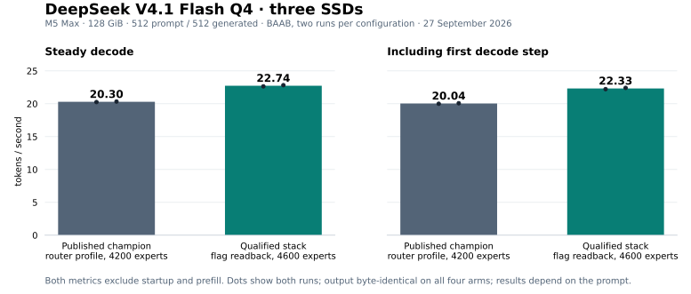

# V4.1 stack — qualified against the published router binary, September 27

**22.740 steady tok/s at pp512/tg512**, with a generation-inclusive median of
**22.325 tok/s**, on an M5 Max with 128 GiB, internal SSD and two Thunderbolt 5
NVMe enclosures. The same-day BAAB against the published `v41-router-qualified-20260921`
binary gained **+12.02% steady / +11.40% inclusive**; the pp512/tg200 ABBA gained
**+12.65% / +11.31%**. Release: `v41-stack-20260927`; profile: `v41-stack-20260927`.
Output is byte-identical to the published reference outputs on every one of the
35 recorded arms.



| Prompt / output tokens | Order | Published binary steady | Stack steady | Steady gain | Published inclusive | Stack inclusive | Inclusive gain |
|---|---|---:|---:|---:|---:|---:|---:|
| Main / 512 | BAAB | 20.300 | **22.740** | **+12.02%** (pairs +2.39, +2.49) | 20.040 | **22.325** | **+11.40%** |
| Main / 200 | ABBA | 19.965 | **22.490** | **+12.65%** (pairs +2.56, +2.49) | 19.315 | **21.500** | **+11.31%** |

Both groups have two runs per configuration. The 512-token stack runs were
**22.65 / 22.83 steady** and **22.23 / 22.42 inclusive**; the published binary
ran **20.26 / 20.34 steady** and **20.00 / 20.08 inclusive** in the same
session. Against the published 21 September medians (20.375 steady / 20.115
inclusive) the new medians are **+11.6% / +11.0%**. All prompts use 512 tokens
with 4,096 context allocation; the main prompt is the opening of *I Promessi
Sposi*. The alternate prompt was not run for this candidate.

Steady excludes the first decode step; inclusive includes it. Both exclude
startup and prefill. Two repeats give an observed range, not a confidence
interval. This compares the previous published Argodrive binary, **not
upstream ds4**, and does not establish broad model quality or chat/server
performance. Keepalive remains enabled and increases power consumption.

**Costs.** Prefill is 2.1% slower (44.02 against 44.95 tok/s at 512/512) and
the first decode step is longer (452 against 371 ms), because the larger cache
seeds more expert slabs after prefill. Median engine-launch-to-first-token
markers were 11.69 s (published) and 11.78 s (stack) at 512/512; these are
engine timestamps, not client-observed latency.

## What the profile adds

`v41-stack-20260927` is the published `v41-router-20260921` profile plus
exactly these settings, and 4,600 cached experts instead of 4,200:

```sh
DS4_ARGODRIVE_FLAG_READBACK=1
DS4_ARGODRIVE_BF16_EPILOGUES=1
DS4_ARGODRIVE_PSO_CACHE=1
```

Each lever was screened alone with interleaved pairs before the stack was
qualified. Screens ran on the candidate binary with the router profile unless
noted; A is the lever off, B is the lever on.

| Lever | What it changes | Screen | Steady medians A → B | Pair deltas |
|---|---|---|---:|---:|
| Flag readback (`DS4_ARGODRIVE_FLAG_READBACK=1`) | A mailbox kernel publishes the router's expert ids from inside the running command buffer; the CPU polls it and starts the cache check and miss reads while the shared-expert work, encoded into the same buffer before the commit, keeps the GPU busy. Falls back to the blocking readback after 50 ms; zero fallbacks were recorded. | 512/200 ABAB | 20.045 → 21.370, **+6.61%** | +1.28, +1.37 |
| 4,600 cached experts | 400 more resident experts; steady misses per token fall 13.09 → 11.06 at 512/512 and 14.32 → 12.22 at 512/200. Measured on the published binary. | 512/512 BAAB | 20.245 → 20.845, **+2.96%** | +0.60, +0.60 |
| 4,600 cached experts | Same setting, 200-token screen. | 512/200 ABAB | 19.890 → 20.555, **+3.34%** | +0.72, +0.61 |
| BF16 epilogues (`DS4_ARGODRIVE_BF16_EPILOGUES=1`) | Three standalone BF16 rounding passes (attention-output low projection and expansion, routed plus shared add) fold into their producers with the same round-to-nearest-even boundary. | 512/200 ABAB | 20.035 → 20.125, +0.45% | +0.09, +0.09 |
| Pipeline cache (`DS4_ARGODRIVE_PSO_CACHE=1`) | Pointer-keyed front cache in front of the pipeline-state lookup. | 512/200 ABAB | 19.955 → 20.120, +0.83% | +0.16, +0.17 |
| Environment lookup cache (code default) | `getenv` results are cached; the decode loop consulted the environment thousands of times per token. `DS4_ARGODRIVE_ENV_CACHE=0` restores the direct path. | 512/200 ABAB | 19.915 → 20.005, +0.45% | +0.03, +0.15 |

The single-lever gains do not add linearly; the stack is qualified as a whole.
Cache sizes of 4,750 and 4,900 experts exceeded the swap-growth guard, with and
without deferring the growth until after the prefill staging pool is released,
and are excluded. Turning the CPU keepalive off on top of the stack measured
−0.09% and the setting stays unchanged.

## All attempts are retained

[Thirty-five timing CSVs](arms/) · [Measured results](results.json)
· [75 source checksums](source-sha256.json) · [Validation](validation.json)
· [Profile export](profile.json)

| Group | Order | Steady tok/s in order | Decode GPU MHz in order | Disposition |
|---|---|---|---|---|
| Stack, 512 tokens (first attempt) | BAAB | 22.77 / 14.00 | 1620 / 762 | excluded: clock gate, stopped after the second arm |
| Stack, 200 tokens (first attempt) | ABBA | 15.14 | 907 | excluded: clock gate, stopped after the first arm |
| Stack, 512 tokens | BAAB | 22.65 / 20.26 / 20.34 / 22.83 | 1620 / 1620 / 1620 / 1620 | passed, two repeats each |
| Stack, 200 tokens | ABBA | 19.94 / 22.50 / 22.48 / 19.99 | 1620 / 1620 / 1620 / 1620 | passed, two repeats each |
| Flag readback screen, 200 tokens | ABAB | 20.10 / 21.38 / 19.99 / 21.36 | 1620 × 4 | screen, passed gates |
| Cache 4,600 screen, 512 tokens | BAAB | 20.86 / 20.26 / 20.23 / 20.83 | 1620 × 4 | screen, passed gates |
| Cache 4,600 screen, 200 tokens | ABAB | 19.85 / 20.57 / 19.93 / 20.54 | 1620 × 4 | screen, passed gates |
| BF16 epilogues screen, 200 tokens | ABAB | 20.03 / 20.12 / 20.04 / 20.13 | 1620 × 4 | screen, passed gates |
| Pipeline cache screen, 200 tokens | ABAB | 19.95 / 20.11 / 19.96 / 20.13 | 1620 × 4 | screen, passed gates |
| Environment cache screen, 200 tokens | ABAB | 19.91 / 19.94 / 19.92 / 20.07 | 1620 × 4 | screen, passed gates |

A is the published binary with `v41-router-20260921` in the qualification
groups. The clock gate requires at least 1,600 MHz active GPU clock during
decode, measured by an independent `powermetrics` collector. The two rejected
groups were the first attempt at the qualification: the published binary's
control arms ran at 762 and 907 MHz, a low-clock mode this machine enters
occasionally and whose cause is unestablished. The passing groups were rerun
after a probe arm confirmed 1,620 MHz; no source or setting changed between the
attempts, and the faster stack arm from the rejected group was not substituted.

Every retained arm recorded zero swap growth, the requested cache allocation
and closing expert counters. No build ran and no second engine process existed
during any arm. This evidence package exports numeric benchmark records and
generic device roles, without private paths, device serials, local addresses or
session transcripts.

## Build and reproduce

```sh
git clone --branch v41-stack-20260927 https://github.com/argonautlabsai/ds4-argodrive.git
cd ds4-argodrive
export DEVELOPER_DIR=/Library/Developer/CommandLineTools
export SDKROOT="$(xcrun --sdk macosx --show-sdk-path)"
xcrun clang --version
make -j4 CC="$(xcrun --find clang)" ds4 ds4-bench ds4-server
python3 argodrive/candidates/2026-09-27-stack/verify-results.py
```

The measured build used **Apple clang 14.0.3 / macOS 26.4 SDK**. Match and verify
the installed toolchain; a directory selection does not install that version.
Keep the executable beside its `metal/` sources. Model files are separate.

Follow the [profile command](../../reproduce/V41-STACK.md#run), using three
fully verified, identical Q4 GGUF copies and the physical sampler, with
`--profile v41-stack-20260927`. The model is 518,596,067,328 bytes with SHA-256
`a5e2e2c3ada4b2e98d9f9e4b50f6d9c2a12c2c96f5da165c07e13aff9264984e`.
The runner refuses unverified replicas, reduced cache allocations and excessive
swap growth. Use separate output directories and retain failed attempts. Build
the control from `v41-router-qualified-20260921` in a separate tree.

## Validation scope

CLI, benchmark and server builds passed. The 28 Python tests, twelve focused
fusion/reader/cache/keepalive fixtures, dedicated router fixture (84 cases ×
four modes × two buffer-view offsets), core V4.1 Metal fixture and
command-memory fixture passed on this source. The new engine paths are opt-in
and off by default; their regression evidence is byte-identical output across
all 35 arms, and no dedicated unit fixture exists yet for the mailbox kernel.
No CPU model inference, CUDA, distributed hardware or broad quality suite was
run. The public profile's exported settings match the measured candidate
exactly. Source hashes match all 75 recorded engine/build/shader files.

The verifier below checks recorded evidence; it does not rerun inference:

```sh
python3 argodrive/candidates/2026-09-27-stack/verify-results.py
python3 -m unittest discover -s argodrive/reproduce/tests -p 'test_*.py'
python3 argodrive/reproduce/test-champion.py
```

Built on [ds4 by antirez and contributors](https://github.com/antirez/ds4).
[Credits and AI assistance](../../../CREDITS.md) ·
[Argodrive app and downloads](https://github.com/argonautlabsai/argodrive).
