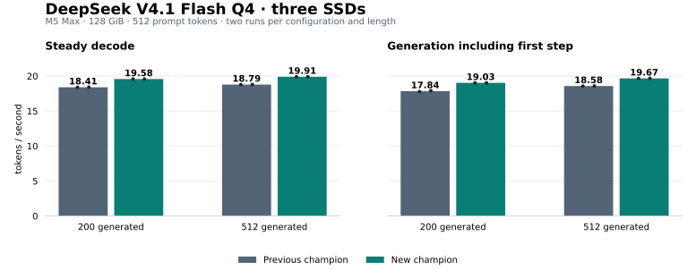

# DeepSeek V4.1 three-drive champion — September 21

The new champion repeats at **19.58 steady tok/s with 200 generated tokens** and
**19.90–19.91 with 512 generated tokens**, on an **M5 Max, 128 GiB**, with the
internal SSD and two Thunderbolt 5 NVMe enclosures. Every run starts from the
same 512-token prompt. This is a measured comparison against our previous
champion; upstream ds4 was not rerun in this campaign.



| Generated tokens | Previous steady median | New steady median (range) | Gain | Previous inclusive median | New inclusive median |
|---|---:|---:|---:|---:|---:|
| 200 | 18.405 | **19.580** (19.58–19.58) | **+6.38%** | 17.845 | **19.030** |
| 512 | 18.790 | **19.905** (19.90–19.91) | **+5.93%** | 18.580 | **19.670** |

Steady excludes the first decode step. Inclusive includes it. Both exclude
model startup and prefill. Each median uses two runs; timing CSV values are
rounded by the benchmark frontend. Do not present these figures as 20 tok/s
inclusive, an upstream comparison, or a universal hardware record.

## What changed

The engine overlaps the resident experts' down projection with missing-expert
reads, dispatches split pieces through persistent reader threads, fuses selected
Q8/BF16 and normalization operations while retaining rounding boundaries, scans
live cache entries with the original victim-order rules, and uses a 32-token
hotness-decay interval. One-threadgroup GPU keepalive covers the decode token;
the existing single CPU keepalive thread remains enabled.

The actual implementation is included in this repository. The source revision
is `cc4907be46af6cb6faa6f3c794a65bf816ecf7d5`; all 75 files in the
[source receipt](source-sha256.json) match the source used for the successful
repeat. Engine defaults remain unchanged: select `champion-20260921` explicitly.
Other diagnostic switches in the source are not recommendations.

Expert replicas use **10:5:5 for prefill**, **10:6:6 for decode**, 9 reader threads
and **4,200 locked cached experts**. Engram remains on the primary SSD with eight
asynchronous whole-row readers. Keepalive increases power use and can lose speed
with competing GPU work; its benefit is hardware and workload dependent.

## Evidence and limits

[All eight timing CSVs](arms/) · [Machine-readable results](results.json) ·
[Exact profile](profile.json) · [Source checksums](source-sha256.json)

The order was ABBA at 200 generated tokens and BAAB at 512. A is the tagged
September 19 code; B is this champion. Full-model checksum receipts and unchanged
file identities were checked for all three SSDs. All eight outputs matched the
historical generated-text SHA-256 for their length, kept the complete cache and
had zero swap growth. Existing swap was present before testing. The measured
decode GPU frequency was 1,620 MHz on both configurations. Within-configuration
speed ranges stayed below 0.2%; the repeat gates passed.

Physical and application counters are kept separate in `results.json`. Expert
application counters closed exactly; decode physical-minus-instrumented residual
was **+0.068% to +0.276%**, unassigned. Physical counters include other I/O and
100 ms boundary uncertainty. The bounded timeline, physical sampler, accounting
and existing CPU/GPU power collectors ran throughout. Power-log alignment used
a calibrated conversion from Python uptime to POSIX monotonic time; original
engine speed timings were unchanged. These are not client-observed TTFT tests.

This is one raw-completion benchmark prompt, not broad model-quality validation.
Two-repeat screening thresholds are not confidence intervals. No CUDA, RDMA or
multi-machine performance result is claimed. The candidate was reconstructed
from preserved source and shaders before this repeat; the measured rebuilt
executable is identified in `results.json`. New build paths can change binary
hashes, so match source/shaders and recheck output rather than assuming an
identical executable.

Verify the published data without loading a model:

```sh
python3 argodrive/champions/2026-09-21/verify-results.py
```

## Build and reproduce

```sh
git clone --branch champion-v41-20260921 https://github.com/argonautlabsai/ds4-argodrive.git
cd ds4-argodrive
export DEVELOPER_DIR=/Library/Developer/CommandLineTools
export SDKROOT="$(xcrun --sdk macosx --show-sdk-path)"
xcrun clang --version
make -j4 CC="$(xcrun --find clang)" ds4 ds4-bench ds4-server
```

The measured build used **Apple clang 14.0.3 / macOS 26.4 SDK**. Check the actual
version: selecting a directory does not install that compiler. Clang 21 / SDK
27 changed greedy output in an earlier comparison. Keep the executable beside
its `metal/` sources. Model weights and prebuilt binaries are not included.

Each SSD must hold the complete identical **518,596,067,328-byte** Q4 GGUF, with
SHA-256 `a5e2e2c3ada4b2e98d9f9e4b50f6d9c2a12c2c96f5da165c07e13aff9264984e`.
Use [verify.py](../../reproduce/README.md#verify-existing-files-once) once to create
your local receipt. Replace the following example paths with your files:

```sh
xcrun clang -O2 argodrive/reproduce/phase-sampler.c -o /tmp/argodrive-phase-sampler \
  -framework CoreFoundation -framework IOKit

python3 argodrive/reproduce/run.py run \
  --variant fork --profile champion-20260921 \
  --engine "$PWD/ds4-bench" \
  --model /path/to/internal/DeepSeek-V4.1-Flash-Q4.gguf \
  --replica /path/to/enclosure-1/DeepSeek-V4.1-Flash-Q4.gguf \
  --replica /path/to/enclosure-2/DeepSeek-V4.1-Flash-Q4.gguf \
  --receipt /path/to/your-receipt.json \
  --prompt "$PWD/speed-bench/promessi_sposi.txt" \
  --prompt-tokens 512 --tokens 200 --accounting --timeline \
  --sampler /tmp/argodrive-phase-sampler --out /path/to/new-arm
```

Use `plan` instead of `run` to inspect without inference; use `--tokens 512` for
the longer result. Output directories must be new. The runner requires distinct
physical SSDs and refuses reduced cache allocations, excessive swap growth or
missing sampler baselines. Keep other inference and copying stopped; record
power and background activity consistently. The sampler and run directories
can contain local paths and device identities; do not publish them wholesale.

For the control, build the separate `champion-v41-20260919` tag and use its
`champion-20260919` profile with the same files, cache, prompt and measurement
policy. Copying old flags onto a different engine is not the recorded control.

## Validation

[Machine-readable validation record](validation.json). A fresh release-checkout build also completed the public 200-token run command with matching output, full cache, zero swap growth and expert traffic on all three SSDs. That functionality check is excluded from the eight-arm speed medians.

The release checkout builds CLI, benchmark and server. Its 25 Python tests,
nine focused reader/kernel/cache/keepalive fixtures, core Metal tests, UBSan
reader/Engram fixtures and CPU-only compile/link/help check pass. No large CPU
model inference was run. The AddressSanitizer runtime aborted during
initialization before the fixture; this is recorded as untested under ASan,
not an ASan pass. Full upstream model-dependent, CUDA and distributed-hardware
suites were not run for this release.

```sh
python3 -m unittest discover -s argodrive/reproduce/tests -p 'test_*.py'
python3 argodrive/reproduce/test-champion.py
python3 argodrive/reproduce/test-readers.py --engine-source . --sanitizers undefined
make test-deepseek41-metal test-metal-ssd-experts test-metal-command-memory
```

Built on [ds4 by antirez and contributors](https://github.com/antirez/ds4).
[Credits and AI-assistance disclosure](../../../CREDITS.md) ·
[Argodrive measurement app](https://github.com/argonautlabsai/argodrive).
